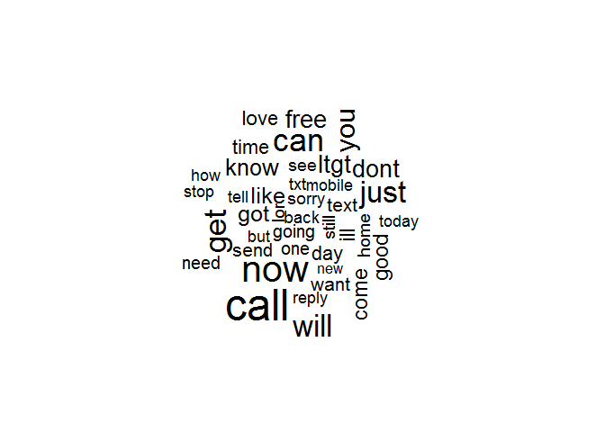

R Notebook
================

This is an [R Markdown](http://rmarkdown.rstudio.com) Notebook. When you execute code within the notebook, the results appear beneath the code.

Try executing this chunk by clicking the *Run* button within the chunk or by placing your cursor inside it and pressing *Ctrl+Shift+Enter*.

``` r
library(RCurl)
```

    ## Warning: package 'RCurl' was built under R version 3.4.4

    ## Loading required package: bitops

``` r
library(tm)
```

    ## Warning: package 'tm' was built under R version 3.4.4

    ## Loading required package: NLP

    ## Warning: package 'NLP' was built under R version 3.4.4

``` r
library(SnowballC)
```

    ## Warning: package 'SnowballC' was built under R version 3.4.4

``` r
library(wordcloud)
```

    ## Warning: package 'wordcloud' was built under R version 3.4.4

    ## Loading required package: RColorBrewer

``` r
library(e1071)
```

    ## Warning: package 'e1071' was built under R version 3.4.4

``` r
library(gmodels)
```

    ## Warning: package 'gmodels' was built under R version 3.4.4

``` r
#sms_raw <-read.csv(text=getURL("https://raw.githubusercontent.com/stedy/Machine-Learning-with-R-datasets/master/sms_spam.csv"), skip=7, header=T)

#tab = read.delim("C:/Users/John/Documents/R/lantz/Lant#z_Bayes/SMSSpamCollection.txt")

#write.table(tab, #file="sms_spam.csv",sep=",",col.names=FALSE,row.names=#FALSE)
 
 #sms_raw <- read.csv("sms_spam.csv", stringsAsFactors = FALSE)
 sms_raw<-read.csv("C:/Users/John/Documents/R/lantz/Lantz_Bayes/spam.csv")
 str(sms_raw$v1)
```

    ##  Factor w/ 2 levels "ham","spam": 1 1 2 1 1 2 1 1 2 2 ...

``` r
table(sms_raw$v1)
```

    ## 
    ##  ham spam 
    ## 4825  747

``` r
sms_corpus<- VCorpus(VectorSource(sms_raw$v2)) #creating a corpus from the data

print(sms_corpus)
```

    ## <<VCorpus>>
    ## Metadata:  corpus specific: 0, document level (indexed): 0
    ## Content:  documents: 5572

``` r
inspect(sms_corpus[1:2]) # summary of first and second message
```

    ## <<VCorpus>>
    ## Metadata:  corpus specific: 0, document level (indexed): 0
    ## Content:  documents: 2
    ## 
    ## [[1]]
    ## <<PlainTextDocument>>
    ## Metadata:  7
    ## Content:  chars: 111
    ## 
    ## [[2]]
    ## <<PlainTextDocument>>
    ## Metadata:  7
    ## Content:  chars: 29

``` r
as.character(sms_corpus[[1]]) # to see the message
```

    ## [1] "Go until jurong point, crazy.. Available only in bugis n great world la e buffet... Cine there got amore wat..."

``` r
lapply(sms_corpus[1:2],as.character) #to view multiple documents
```

    ## $`1`
    ## [1] "Go until jurong point, crazy.. Available only in bugis n great world la e buffet... Cine there got amore wat..."
    ## 
    ## $`2`
    ## [1] "Ok lar... Joking wif u oni..."

``` r
#cleaning data

 sms_corpus_clean <- tm_map(sms_corpus,
 content_transformer(tolower))  #making all characters the corpus to lower case, standardizing 
 
 # to check out put
 as.character(sms_corpus[[1]])
```

    ## [1] "Go until jurong point, crazy.. Available only in bugis n great world la e buffet... Cine there got amore wat..."

``` r
  as.character(sms_corpus_clean[[1]])
```

    ## [1] "go until jurong point, crazy.. available only in bugis n great world la e buffet... cine there got amore wat..."

``` r
sms_corpus_clean <- tm_map(sms_corpus_clean, removeNumbers) # remove numbers from messages
   
   #removing stop words filler words(if,and,but...)
 sms_corpus_clean <- tm_map(sms_corpus_clean,
 removeWords, stopwords())
 
  as.character(sms_corpus_clean[1])
```

    ## [1] "list(list(content = \"go  jurong point, crazy.. available   bugis n great world la e buffet... cine  got amore wat...\", meta = list(author = character(0), datetimestamp = list(sec = 55.9749040603638, min = 58, hour = 10, mday = 6, mon = 0, year = 119, wday = 0, yday = 5, isdst = 0), description = character(0), heading = character(0), id = \"1\", language = \"en\", origin = character(0))))"
    ## [2] "list()"                                                                                                                                                                                                                                                                                                                                                                                                  
    ## [3] "list()"

``` r
# removing punctuation
sms_corpus_clean <- tm_map(sms_corpus_clean, removePunctuation)

 as.character(sms_corpus_clean[1])
```

    ## [1] "list(list(content = \"go  jurong point crazy available   bugis n great world la e buffet cine  got amore wat\", meta = list(author = character(0), datetimestamp = list(sec = 55.9749040603638, min = 58, hour = 10, mday = 6, mon = 0, year = 119, wday = 0, yday = 5, isdst = 0), description = character(0), heading = character(0), id = \"1\", language = \"en\", origin = character(0))))"
    ## [2] "list()"                                                                                                                                                                                                                                                                                                                                                                                         
    ## [3] "list()"

``` r
  #stemming
sms_corpus_clean <- tm_map(sms_corpus_clean, stemDocument)

 as.character(sms_corpus_clean[1])
```

    ## [1] "list(list(content = \"go jurong point crazi avail bugi n great world la e buffet cine got amor wat\", meta = list(author = character(0), datetimestamp = list(sec = 55.9749040603638, min = 58, hour = 10, mday = 6, mon = 0, year = 119, wday = 0, yday = 5, isdst = 0), description = character(0), heading = character(0), id = \"1\", language = \"en\", origin = character(0))))"
    ## [2] "list()"                                                                                                                                                                                                                                                                                                                                                                               
    ## [3] "list()"

``` r
#strip white space
 sms_corpus_clean <- tm_map(sms_corpus_clean, stripWhitespace)
 
  as.character(sms_corpus_clean[1])
```

    ## [1] "list(list(content = \"go jurong point crazi avail bugi n great world la e buffet cine got amor wat\", meta = list(author = character(0), datetimestamp = list(sec = 55.9749040603638, min = 58, hour = 10, mday = 6, mon = 0, year = 119, wday = 0, yday = 5, isdst = 0), description = character(0), heading = character(0), id = \"1\", language = \"en\", origin = character(0))))"
    ## [2] "list()"                                                                                                                                                                                                                                                                                                                                                                               
    ## [3] "list()"

``` r
#data preparation

 sms_dtm <- DocumentTermMatrix(sms_corpus_clean)

#creating and training data
 sms_dtm_train <- sms_dtm[1:4169, ]
 sms_dtm_test <- sms_dtm[4170:5559, ]
 
 sms_train_labels <- sms_raw[1:4169, ]$v1    
 sms_test_labels <- sms_raw[4170:5559, ]$v1
  
  #confirm labels
  prop.table(table(sms_train_labels))
```

    ## sms_train_labels
    ##       ham      spam 
    ## 0.8644759 0.1355241

``` r
   prop.table(table(sms_test_labels))
```

    ## sms_test_labels
    ##       ham      spam 
    ## 0.8705036 0.1294964

``` r
#visualizing text data
wordcloud(sms_corpus_clean,min.freq = 100,scale=c(2,.5), random.order = FALSE)
```


``` r
# changed scale to fit 

 spam <- subset(sms_raw, v1 = 2)
 ham <- subset(sms_raw,v1=1)
 
  wordcloud(spam$v2, max.words = 40, scale = c(3, 0.5))
```

    ## Warning in tm_map.SimpleCorpus(corpus, tm::removePunctuation):
    ## transformation drops documents

    ## Warning in tm_map.SimpleCorpus(corpus, function(x) tm::removeWords(x,
    ## tm::stopwords())): transformation drops documents


``` r
wordcloud(ham$v2, max.words = 40, scale = c(3, 0.5))
```

    ## Warning in tm_map.SimpleCorpus(corpus, tm::removePunctuation):
    ## transformation drops documents

    ## Warning in tm_map.SimpleCorpus(corpus, tm::removePunctuation):
    ## transformation drops documents



``` r
#creating indicator features p119

 findFreqTerms(sms_dtm_train, 5)# frequent terms appearing >5
```

    ##    [1] "‰û÷s"          "‰ûò"           "å£wk"          "abiola"       
    ##    [5] "abl"           "abt"           "accept"        "access"       
    ##    [9] "account"       "across"        "activ"         "actual"       
    ##   [13] "add"           "address"       "admir"         "adult"        
    ##   [17] "advanc"        "aft"           "afternoon"     "aftr"         
    ##   [21] "age"           "ago"           "ahead"         "aight"        
    ##   [25] "aint"          "air"           "aiyah"         "alex"         
    ##   [29] "almost"        "alon"          "alreadi"       "alright"      
    ##   [33] "alrit"         "also"          "alway"         "amp"          
    ##   [37] "angri"         "announc"       "anoth"         "answer"       
    ##   [41] "anybodi"       "anymor"        "anyon"         "anyth"        
    ##   [45] "anytim"        "anyway"        "apart"         "app"          
    ##   [49] "appli"         "appoint"       "appreci"       "april"        
    ##   [53] "ard"           "area"          "argument"      "arm"          
    ##   [57] "around"        "arrang"        "arrest"        "arriv"        
    ##   [61] "asap"          "ask"           "askd"          "ass"          
    ##   [65] "attempt"       "auction"       "avail"         "ave"          
    ##   [69] "avoid"         "await"         "award"         "away"         
    ##   [73] "awesom"        "babe"          "babi"          "back"         
    ##   [77] "bad"           "bag"           "bak"           "balanc"       
    ##   [81] "bank"          "bare"          "bath"          "batteri"      
    ##   [85] "bcoz"          "bcum"          "bday"          "beauti"       
    ##   [89] "becom"         "bed"           "bedroom"       "begin"        
    ##   [93] "believ"        "belli"         "best"          "better"       
    ##   [97] "bid"           "big"           "bill"          "bird"         
    ##  [101] "birthday"      "bit"           "black"         "blank"        
    ##  [105] "bless"         "blue"          "bluetooth"     "bodi"         
    ##  [109] "bold"          "bonus"         "boo"           "book"         
    ##  [113] "bore"          "boss"          "bother"        "bout"         
    ##  [117] "bowl"          "box"           "boy"           "boytoy"       
    ##  [121] "brand"         "break"         "breath"        "brilliant"    
    ##  [125] "bring"         "brother"       "bslvyl"        "btnationalr"  
    ##  [129] "budget"        "bugi"          "bus"           "busi"         
    ##  [133] "buy"           "buzz"          "cabin"         "cafe"         
    ##  [137] "cal"           "call"          "caller"        "callertun"    
    ##  [141] "camcord"       "came"          "camera"        "can"          
    ##  [145] "cancel"        "cant"          "car"           "card"         
    ##  [149] "care"          "carlo"         "case"          "cash"         
    ##  [153] "cashbal"       "catch"         "caus"          "chanc"        
    ##  [157] "chang"         "charact"       "charg"         "chariti"      
    ##  [161] "chat"          "cheap"         "check"         "cheer"        
    ##  [165] "chennai"       "chikku"        "childish"      "children"     
    ##  [169] "chines"        "choic"         "choos"         "christma"     
    ##  [173] "cine"          "cinema"        "claim"         "class"        
    ##  [177] "clean"         "clear"         "click"         "clock"        
    ##  [181] "close"         "club"          "code"          "coffe"        
    ##  [185] "coin"          "cold"          "colleagu"      "collect"      
    ##  [189] "colleg"        "colour"        "come"          "comin"        
    ##  [193] "comp"          "compani"       "competit"      "complet"      
    ##  [197] "complimentari" "comput"        "concentr"      "condit"       
    ##  [201] "confirm"       "congrat"       "congratul"     "connect"      
    ##  [205] "contact"       "content"       "convey"        "cook"         
    ##  [209] "cool"          "copi"          "correct"       "cos"          
    ##  [213] "cost"          "countri"       "coupl"         "cours"        
    ##  [217] "cover"         "coz"           "crave"         "crazi"        
    ##  [221] "credit"        "cri"           "croydon"       "cuddl"        
    ##  [225] "cum"           "cup"           "current"       "custcar"      
    ##  [229] "custom"        "cut"           "cute"          "cuz"          
    ##  [233] "dad"           "daddi"         "damn"          "darl"         
    ##  [237] "darlin"        "darren"        "dat"           "date"         
    ##  [241] "day"           "dead"          "deal"          "dear"         
    ##  [245] "decid"         "deep"          "definit"       "del"          
    ##  [249] "delet"         "deliv"         "deliveri"      "den"          
    ##  [253] "depend"        "detail"        "dey"           "didnt"        
    ##  [257] "die"           "differ"        "difficult"     "digit"        
    ##  [261] "din"           "dinner"        "direct"        "dis"          
    ##  [265] "discount"      "discuss"       "disturb"       "dnt"          
    ##  [269] "doctor"        "doesnt"        "dog"           "doin"         
    ##  [273] "dollar"        "don"           "don‰û÷t"       "donåõt"       
    ##  [277] "done"          "dont"          "door"          "doubl"        
    ##  [281] "download"      "draw"          "dream"         "drink"        
    ##  [285] "drive"         "drop"          "drug"          "dude"         
    ##  [289] "dun"           "dunno"         "dvd"           "earli"        
    ##  [293] "earlier"       "easi"          "eat"           "eatin"        
    ##  [297] "either"        "els"           "email"         "embarass"     
    ##  [301] "empti"         "end"           "enemi"         "energi"       
    ##  [305] "england"       "enjoy"         "enough"        "enter"        
    ##  [309] "entri"         "envelop"       "especi"        "etc"          
    ##  [313] "euro"          "eve"           "even"          "ever"         
    ##  [317] "everi"         "everyon"       "everyth"       "exact"        
    ##  [321] "exam"          "excel"         "excit"         "excus"        
    ##  [325] "expect"        "experi"        "expir"         "extra"        
    ##  [329] "eye"           "face"          "facebook"      "fact"         
    ##  [333] "fall"          "famili"        "fanci"         "fantasi"      
    ##  [337] "fantast"       "far"           "fast"          "fat"          
    ##  [341] "father"        "fault"         "feel"          "felt"         
    ##  [345] "fetch"         "fight"         "figur"         "file"         
    ##  [349] "fill"          "film"          "final"         "find"         
    ##  [353] "fine"          "finger"        "finish"        "first"        
    ##  [357] "five"          "fix"           "flight"        "flirt"        
    ##  [361] "flower"        "follow"        "fone"          "food"         
    ##  [365] "forev"         "forget"        "forgot"        "forward"      
    ##  [369] "found"         "free"          "freemsg"       "freephon"     
    ##  [373] "fren"          "fri"           "friday"        "friend"       
    ##  [377] "friendship"    "frm"           "frnd"          "frnds"        
    ##  [381] "fuck"          "full"          "fullonsmscom"  "fun"          
    ##  [385] "funni"         "futur"         "gal"           "game"         
    ##  [389] "gap"           "gas"           "gave"          "gay"          
    ##  [393] "gentl"         "get"           "gettin"        "gift"         
    ##  [397] "girl"          "give"          "glad"          "god"          
    ##  [401] "goe"           "goin"          "gone"          "gonna"        
    ##  [405] "good"          "goodmorn"      "goodnight"     "got"          
    ##  [409] "goto"          "gotta"         "great"         "green"        
    ##  [413] "greet"         "grin"          "group"         "guarante"     
    ##  [417] "gud"           "guess"         "guy"           "gym"          
    ##  [421] "haf"           "haha"          "hai"           "hair"         
    ##  [425] "half"          "hand"          "hang"          "happen"       
    ##  [429] "happi"         "hard"          "hav"           "havent"       
    ##  [433] "head"          "hear"          "heard"         "heart"        
    ##  [437] "heavi"         "hee"           "hell"          "hello"        
    ##  [441] "help"          "hey"           "hgsuiteland"   "high"         
    ##  [445] "hit"           "hiya"          "hmm"           "hmmm"         
    ##  [449] "hmv"           "hol"           "hold"          "holder"       
    ##  [453] "holiday"       "home"          "honey"         "hook"         
    ##  [457] "hop"           "hope"          "horni"         "hospit"       
    ##  [461] "hot"           "hotel"         "hour"          "hous"         
    ##  [465] "housemaid"     "how"           "howev"         "howz"         
    ##  [469] "hrs"           "hug"           "huh"           "hungri"       
    ##  [473] "hurri"         "hurt"          "iam"           "ice"          
    ##  [477] "idea"          "identifi"      "ignor"         "ill"          
    ##  [481] "imagin"        "imma"          "immedi"        "import"       
    ##  [485] "inc"           "inch"          "includ"        "india"        
    ##  [489] "indian"        "info"          "inform"        "instead"      
    ##  [493] "interest"      "interview"     "invit"         "ipod"         
    ##  [497] "irrit"         "ish"           "issu"          "ive"          
    ##  [501] "izzit"         "januari"       "jay"           "job"          
    ##  [505] "john"          "join"          "joke"          "joy"          
    ##  [509] "jus"           "just"          "juz"           "kalli"        
    ##  [513] "kate"          "keep"          "kept"          "key"          
    ##  [517] "kick"          "kid"           "kill"          "kind"         
    ##  [521] "kinda"         "king"          "kiss"          "knew"         
    ##  [525] "know"          "knw"           "ladi"          "land"         
    ##  [529] "landlin"       "laptop"        "lar"           "last"         
    ##  [533] "late"          "later"         "latest"        "laugh"        
    ##  [537] "lazi"          "ldn"           "lead"          "learn"        
    ##  [541] "least"         "leav"          "lect"          "left"         
    ##  [545] "leh"           "lei"           "lemm"          "less"         
    ##  [549] "lesson"        "let"           "letter"        "liao"         
    ##  [553] "librari"       "lick"          "lie"           "life"         
    ##  [557] "lift"          "light"         "like"          "line"         
    ##  [561] "link"          "list"          "listen"        "littl"        
    ##  [565] "live"          "load"          "loan"          "local"        
    ##  [569] "locat"         "log"           "login"         "lol"          
    ##  [573] "long"          "longer"        "look"          "lor"          
    ##  [577] "lose"          "lost"          "lot"           "lovabl"       
    ##  [581] "love"          "lover"         "loverboy"      "loyalti"      
    ##  [585] "ltd"           "ltdecimalgt"   "ltgt"          "lttimegt"     
    ##  [589] "luck"          "lucki"         "lunch"         "luv"          
    ##  [593] "made"          "mah"           "mail"          "make"         
    ##  [597] "man"           "mani"          "march"         "mark"         
    ##  [601] "marri"         "marriag"       "match"         "mate"         
    ##  [605] "matter"        "maxim"         "may"           "mayb"         
    ##  [609] "mean"          "meant"         "med"           "medic"        
    ##  [613] "meet"          "meh"           "mell"          "member"       
    ##  [617] "men"           "menu"          "merri"         "messag"       
    ##  [621] "met"           "mid"           "midnight"      "might"        
    ##  [625] "min"           "mind"          "mine"          "minut"        
    ##  [629] "miracl"        "miss"          "mistak"        "moan"         
    ##  [633] "mob"           "mobil"         "mobileupd"     "mode"         
    ##  [637] "mom"           "moment"        "mon"           "monday"       
    ##  [641] "money"         "month"         "mood"          "moon"         
    ##  [645] "morn"          "motorola"      "move"          "movi"         
    ##  [649] "mrng"          "mrt"           "msg"           "msgs"         
    ##  [653] "mths"          "much"          "mum"           "murder"       
    ##  [657] "music"         "must"          "muz"           "nah"          
    ##  [661] "nake"          "name"          "nation"        "natur"        
    ##  [665] "naughti"       "near"          "need"          "net"          
    ##  [669] "network"       "neva"          "never"         "new"          
    ##  [673] "news"          "next"          "nice"          "nigeria"      
    ##  [677] "night"         "nite"          "nobodi"        "noe"          
    ##  [681] "nokia"         "none"          "noon"          "nope"         
    ##  [685] "normal"        "noth"          "notic"         "now"          
    ##  [689] "ntt"           "num"           "number"        "nxt"          
    ##  [693] "nyt"           "offer"         "offic"         "offici"       
    ##  [697] "okay"          "oki"           "old"           "omw"          
    ##  [701] "one"           "onlin"         "oop"           "open"         
    ##  [705] "oper"          "opinion"       "opt"           "optout"       
    ##  [709] "orang"         "orchard"       "order"         "oredi"        
    ##  [713] "oso"           "other"         "otherwis"      "outsid"       
    ##  [717] "pack"          "page"          "paid"          "pain"         
    ##  [721] "paper"         "parent"        "park"          "part"         
    ##  [725] "parti"         "partner"       "pass"          "passion"      
    ##  [729] "password"      "past"          "pay"           "peac"         
    ##  [733] "peopl"         "per"           "person"        "pete"         
    ##  [737] "phone"         "photo"         "pic"           "pick"         
    ##  [741] "pictur"        "piec"          "pix"           "pizza"        
    ##  [745] "place"         "plan"          "plane"         "play"         
    ##  [749] "player"        "pleas"         "pleasur"       "pls"          
    ##  [753] "plus"          "plz"           "pmin"          "pmsg"         
    ##  [757] "pobox"         "poboxwwq"      "point"         "poli"         
    ##  [761] "polic"         "poor"          "pop"           "possibl"      
    ##  [765] "post"          "pound"         "power"         "pple"         
    ##  [769] "ppm"           "practic"       "pray"          "prefer"       
    ##  [773] "prepar"        "press"         "pretti"        "price"        
    ##  [777] "princess"      "privat"        "prize"         "prob"         
    ##  [781] "probabl"       "problem"       "process"       "project"      
    ##  [785] "promis"        "pub"           "put"           "qualiti"      
    ##  [789] "question"      "quick"         "quit"          "quiz"         
    ##  [793] "quot"          "rain"          "rate"          "rather"       
    ##  [797] "rcvd"          "reach"         "read"          "readi"        
    ##  [801] "real"          "realiz"        "realli"        "reason"       
    ##  [805] "receipt"       "receiv"        "recent"        "record"       
    ##  [809] "refer"         "regard"        "regist"        "remain"       
    ##  [813] "rememb"        "remind"        "remov"         "rent"         
    ##  [817] "rental"        "repli"         "repres"        "request"      
    ##  [821] "respond"       "respons"       "rest"          "result"       
    ##  [825] "return"        "reveal"        "review"        "right"        
    ##  [829] "ring"          "rington"       "rite"          "road"         
    ##  [833] "rock"          "room"          "roommat"       "rose"         
    ##  [837] "round"         "rowwjhl"       "rpli"          "rreveal"      
    ##  [841] "run"           "sad"           "sae"           "safe"         
    ##  [845] "said"          "sale"          "sam"           "sat"          
    ##  [849] "saturday"      "savamob"       "save"          "saw"          
    ##  [853] "say"           "sch"           "school"        "score"        
    ##  [857] "scream"        "sea"           "search"        "season"       
    ##  [861] "sec"           "second"        "secret"        "see"          
    ##  [865] "seem"          "seen"          "select"        "self"         
    ##  [869] "sell"          "semest"        "send"          "sens"         
    ##  [873] "sent"          "serious"       "servic"        "set"          
    ##  [877] "settl"         "sex"           "sexi"          "shall"        
    ##  [881] "share"         "shd"           "ship"          "shirt"        
    ##  [885] "shit"          "shop"          "short"         "show"         
    ##  [889] "shower"        "shuhui"        "sick"          "side"         
    ##  [893] "sigh"          "sight"         "sign"          "silent"       
    ##  [897] "simpl"         "sinc"          "sing"          "singl"        
    ##  [901] "sir"           "sis"           "sister"        "sit"          
    ##  [905] "situat"        "sky"           "slave"         "sleep"        
    ##  [909] "slept"         "slow"          "slowli"        "small"        
    ##  [913] "smile"         "smoke"         "sms"           "smth"         
    ##  [917] "snow"          "sofa"          "solv"          "somebodi"     
    ##  [921] "someon"        "someth"        "sometim"       "somewher"     
    ##  [925] "song"          "soni"          "sonyericsson"  "soon"         
    ##  [929] "sorri"         "sort"          "sound"         "space"        
    ##  [933] "speak"         "special"       "specialcal"    "spend"        
    ##  [937] "spent"         "spoke"         "sport"         "spree"        
    ##  [941] "stand"         "star"          "start"         "statement"    
    ##  [945] "station"       "stay"          "std"           "still"        
    ##  [949] "stock"         "stop"          "store"         "stori"        
    ##  [953] "str"           "straight"      "street"        "strong"       
    ##  [957] "student"       "studi"         "stuff"         "stupid"       
    ##  [961] "style"         "sub"           "subscrib"      "success"      
    ##  [965] "summer"        "sun"           "sunday"        "sunshin"      
    ##  [969] "support"       "suppos"        "sure"          "surpris"      
    ##  [973] "sweet"         "swing"         "system"        "take"         
    ##  [977] "talk"          "tampa"         "tcs"           "teach"        
    ##  [981] "team"          "tear"          "teas"          "tel"          
    ##  [985] "tell"          "ten"           "tenerif"       "term"         
    ##  [989] "test"          "text"          "thank"         "thanx"        
    ##  [993] "that"          "thing"         "think"         "thinkin"      
    ##  [997] "thk"           "thnk"          "tho"           "though"       
    ## [1001] "thought"       "throw"         "thru"          "tht"          
    ## [1005] "thur"          "ticket"        "til"           "till"         
    ## [1009] "time"          "tire"          "titl"          "tmr"          
    ## [1013] "tncs"          "today"         "togeth"        "told"         
    ## [1017] "tomo"          "tomorrow"      "tone"          "tonight"      
    ## [1021] "tonit"         "took"          "top"           "tot"          
    ## [1025] "total"         "touch"         "tough"         "tour"         
    ## [1029] "toward"        "town"          "track"         "train"        
    ## [1033] "transact"      "treat"         "tri"           "trip"         
    ## [1037] "troubl"        "true"          "trust"         "truth"        
    ## [1041] "tscs"          "ttyl"          "tuesday"       "turn"         
    ## [1045] "twice"         "two"           "txt"           "txting"       
    ## [1049] "txts"          "type"          "ufind"         "ugh"          
    ## [1053] "umma"          "uncl"          "understand"    "unless"       
    ## [1057] "unlimit"       "unredeem"      "unsub"         "unsubscrib"   
    ## [1061] "updat"         "ure"           "urgent"        "urself"       
    ## [1065] "use"           "usf"           "usual"         "uve"          
    ## [1069] "valentin"      "valid"         "valu"          "vari"         
    ## [1073] "verifi"        "via"           "video"         "visit"        
    ## [1077] "voic"          "voucher"       "wait"          "wake"         
    ## [1081] "walk"          "wan"           "wana"          "wanna"        
    ## [1085] "want"          "wap"           "warm"          "wast"         
    ## [1089] "wat"           "watch"         "water"         "way"          
    ## [1093] "weak"          "wear"          "weather"       "wed"          
    ## [1097] "wednesday"     "weed"          "week"          "weekend"      
    ## [1101] "weight"        "welcom"        "well"          "wen"          
    ## [1105] "went"          "wer"           "wet"           "what"         
    ## [1109] "whatev"        "whenev"        "whole"         "wid"          
    ## [1113] "wif"           "wife"          "wil"           "will"         
    ## [1117] "win"           "wine"          "winner"        "wish"         
    ## [1121] "wit"           "within"        "without"       "wiv"          
    ## [1125] "wkli"          "wnt"           "woke"          "won"          
    ## [1129] "wonder"        "wont"          "word"          "work"         
    ## [1133] "workin"        "world"         "worri"         "worth"        
    ## [1137] "wot"           "wow"           "write"         "wrong"        
    ## [1141] "wun"           "wwwgetzedcouk" "xmas"          "xxx"          
    ## [1145] "yahoo"         "yar"           "yeah"          "year"         
    ## [1149] "yep"           "yes"           "yest"          "yesterday"    
    ## [1153] "yet"           "yoga"          "yogasana"      "yrs"          
    ## [1157] "yun"           "yup"

``` r
 sms_freq_words <- findFreqTerms(sms_dtm_train, 5)
 
 str(sms_freq_words)
```

    ##  chr [1:1158] "‰û÷s" "‰ûò" "å£wk" "abiola" "abl" "abt" "accept" ...

``` r
  #filter DTM
 
  sms_dtm_freq_train<- sms_dtm_train[ , sms_freq_words]
  
 sms_dtm_freq_test <- sms_dtm_test[ , sms_freq_words]
 
#convert sparce matrix numbers to yes/no strings
 
  convert_counts <- function(x) {
 x <- ifelse(x > 0, "Yes", "No")
  }
  
sms_train <- apply(sms_dtm_freq_train, MARGIN = 2,
 convert_counts)
   
 sms_test <- apply(sms_dtm_freq_test, MARGIN = 2,
 convert_counts)
```

``` r
#training a model on the data

 sms_classifier <- naiveBayes(sms_train, sms_train_labels)

#evaluate performance

 sms_test_pred <- predict(sms_classifier, sms_test)
 
CrossTable(sms_test_pred, sms_test_labels,
 prop.chisq = FALSE, prop.t = FALSE,
 dnn = c('predicted', 'actual'))
```

    ## 
    ##  
    ##    Cell Contents
    ## |-------------------------|
    ## |                       N |
    ## |           N / Row Total |
    ## |           N / Col Total |
    ## |-------------------------|
    ## 
    ##  
    ## Total Observations in Table:  1390 
    ## 
    ##  
    ##              | actual 
    ##    predicted |       ham |      spam | Row Total | 
    ## -------------|-----------|-----------|-----------|
    ##          ham |      1201 |        25 |      1226 | 
    ##              |     0.980 |     0.020 |     0.882 | 
    ##              |     0.993 |     0.139 |           | 
    ## -------------|-----------|-----------|-----------|
    ##         spam |         9 |       155 |       164 | 
    ##              |     0.055 |     0.945 |     0.118 | 
    ##              |     0.007 |     0.861 |           | 
    ## -------------|-----------|-----------|-----------|
    ## Column Total |      1210 |       180 |      1390 | 
    ##              |     0.871 |     0.129 |           | 
    ## -------------|-----------|-----------|-----------|
    ## 
    ## 

``` r
#improving model performance p123
 sms_classifier2 <- naiveBayes(sms_train, sms_train_labels,
 laplace = 1) #added laplace estimator

 sms_test_pred2 <- predict(sms_classifier2, sms_test)
 
  CrossTable(sms_test_pred2, sms_test_labels,
 prop.chisq = FALSE, prop.t = FALSE, prop.r = FALSE,
 dnn = c('predicted', 'actual'))
```

    ## 
    ##  
    ##    Cell Contents
    ## |-------------------------|
    ## |                       N |
    ## |           N / Col Total |
    ## |-------------------------|
    ## 
    ##  
    ## Total Observations in Table:  1390 
    ## 
    ##  
    ##              | actual 
    ##    predicted |       ham |      spam | Row Total | 
    ## -------------|-----------|-----------|-----------|
    ##          ham |      1203 |        28 |      1231 | 
    ##              |     0.994 |     0.156 |           | 
    ## -------------|-----------|-----------|-----------|
    ##         spam |         7 |       152 |       159 | 
    ##              |     0.006 |     0.844 |           | 
    ## -------------|-----------|-----------|-----------|
    ## Column Total |      1210 |       180 |      1390 | 
    ##              |     0.871 |     0.129 |           | 
    ## -------------|-----------|-----------|-----------|
    ## 
    ## 

Add a new chunk by clicking the *Insert Chunk* button on the toolbar or by pressing *Ctrl+Alt+I*.

When you save the notebook, an HTML file containing the code and output will be saved alongside it (click the *Preview* button or press *Ctrl+Shift+K* to preview the HTML file).

The preview shows you a rendered HTML copy of the contents of the editor. Consequently, unlike *Knit*, *Preview* does not run any R code chunks. Instead, the output of the chunk when it was last run in the editor is displayed.
